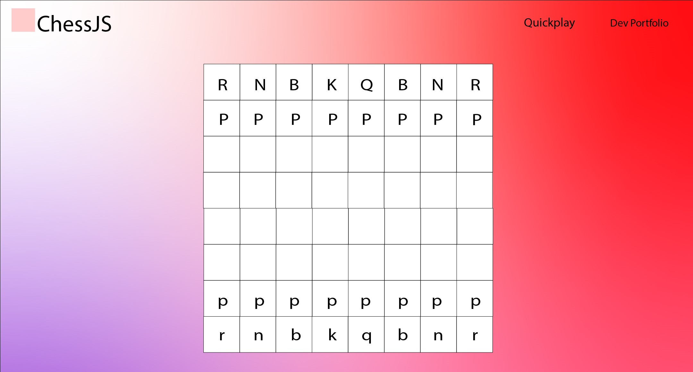

# Chess JS

### Original Wireframe

### Finished Product

---

### Table of Content

- [Chess JS](#chess-js)
    - [Original Wireframe](#original-wireframe)
    - [Finished Product](#finished-product)
  - 
    - [Table of Content](#table-of-content)
  - [Description](#description)
  - [How To Use](#how-to-use)
      - [Deployment](#deployment)
      - [Installation](#installation)
  - [References](#references)
  - [License](#license)
  - [Author Info](#author-info)

---

## Description

ChessJS aims to display my skills in creating complex logic that is easily readable. The game is built using HTML, CSS, and JavaScript. The game is fully playable and has a responsive design. The game is also fully playable on mobile devices. The game is built using the module pattern and is fully object oriented.
 
---

## How To Use

#### Deployment

The website is deployed [here]().

#### Installation

N/A

[Back To The Top](#chess-js)

---

## References

 - Jquery: [https://jquery.com/](https://jquery.com/)
 - Jquery UI: [https://jqueryui.com/](https://jqueryui.com/)
 - Bootstrap: [https://getbootstrap.com/](https://getbootstrap.com/)
 - W3Schools: [https://www.w3schools.com/](https://www.w3schools.com/)

[Back To The Top](#chess-js)

---

## License

No liscense.

[Back To The Top](#chess-js)

---

## Author Info

Check out the 'About Me' section in my [portfolio](https://bizthehabesha.github.io/bisratgebrekidan-portfolio/).

[Back To The Top](#chess-js)